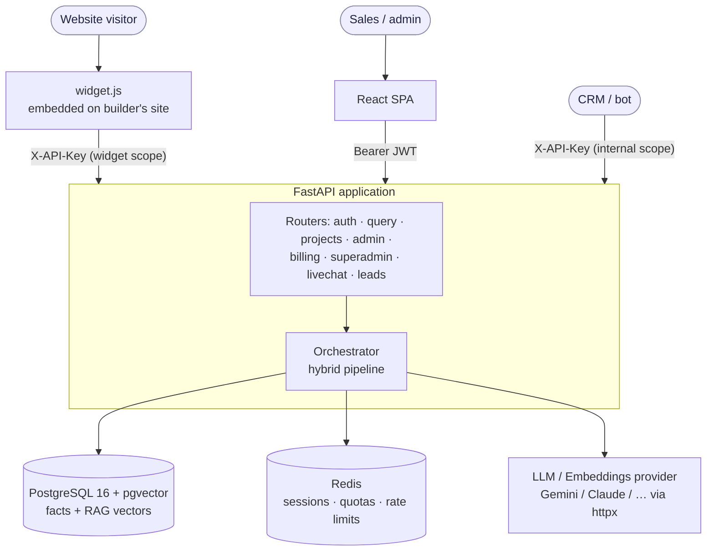
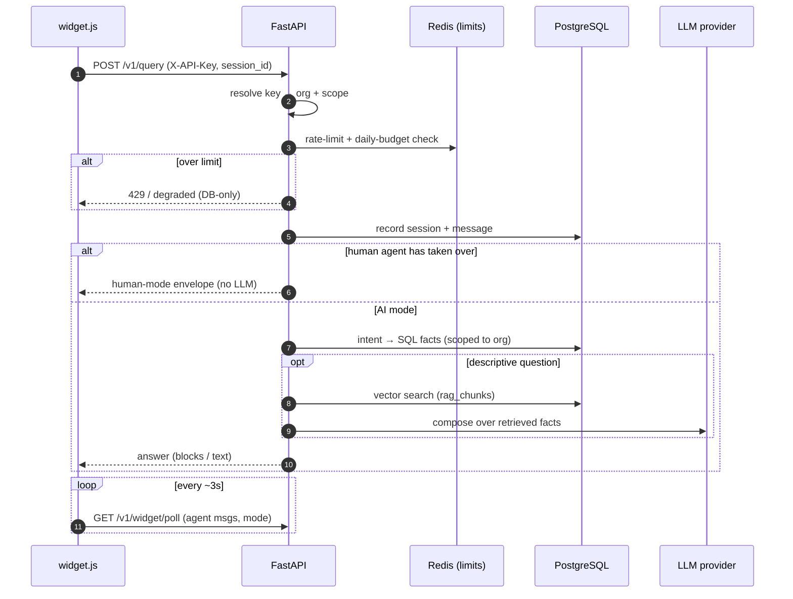
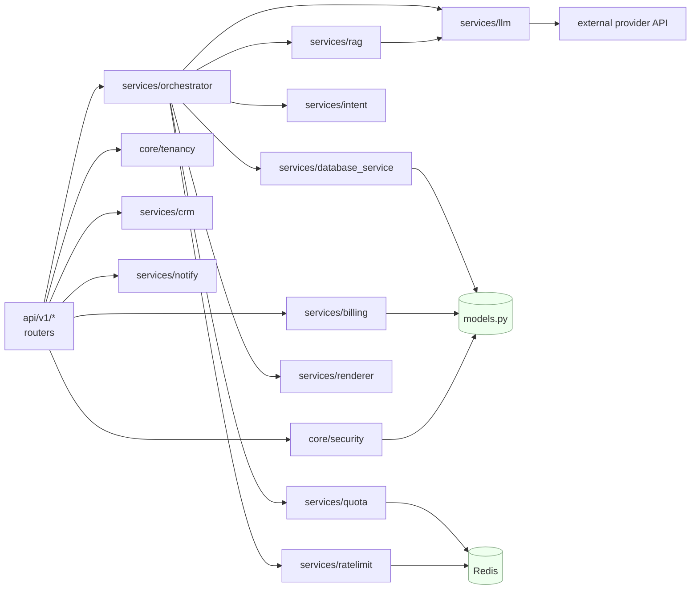

# Architecture

## Component overview



| Component | Role |
|---|---|
| **FastAPI app** | All HTTP endpoints, auth, the answer orchestrator, background tasks. |
| **PostgreSQL + pgvector** | The single source of truth: structured facts *and* RAG chunk embeddings (`rag_chunks.embedding` is a `vector`). |
| **Redis** | Session memory (recent conversation turns), per-org daily budgets, and widget rate-limit counters. Fail-open — an outage degrades limits, never data. |
| **LLM / embedding provider** | Pluggable by configuration only (`LLM_PROVIDER`, `EMBEDDING_PROVIDER`). `mock` runs the whole engine with no API key. |
| **React SPA** | The staff/admin interface (Vite build, served separately). |
| **widget.js** | A dependency-free embeddable chat widget served from `/static/widget.js`. |

---

## The hybrid answer pipeline

Every question flows through the same ordered pipeline. Deterministic sources
answer first; the LLM is the last resort. (Full detail: [rag-pipeline.md](rag-pipeline.md).)

```
Query
  │
  ├─ Intent detection        (what is being asked, about which project?)
  ├─ Tenant scoping          (restrict to the caller's organization)
  ├─ DATABASE (SQL)          (price, plan, inventory, dates — exact facts)
  ├─ Calculation             (EMI, totals, comparisons)
  ├─ RAG retrieval           (vector search over the org's document chunks)
  ├─ LLM                     (summarize/compose ONLY over retrieved facts)
  └─ Renderer                (blocks for the app; humanized text for the widget)
```

Facts never pass *through* the LLM to be re-generated — they are rendered
directly. The LLM only writes prose around facts that were already retrieved.

---

## Request lifecycle (a website chat message)



1. `widget.js` POSTs `/v1/query` with the `X-API-Key` (a **widget-scope** key) and a `session_id`.
2. FastAPI resolves the key → the owning organization; the key's scope limits it to the widget's four endpoints.
3. Rate limits are checked (per-session, per-IP, per-org daily budget).
4. The message and any new session are recorded (`chat_sessions`, `chat_messages`).
5. If a human agent has taken over, the engine returns a "human mode" envelope and does not call the LLM.
6. Otherwise the pipeline runs; a lead is auto-captured if the visitor typed a phone number.
7. The widget polls `/v1/widget/poll` every few seconds for agent messages and mode changes.

---

## Multi-tenancy

- Every tenant is an **organization**. Users, projects, builders, documents,
  leads, chat sessions and query logs all carry `organization_id`.
- Scoping is applied on the server for every request via
  `core/tenancy.py` (`org_scope_id`, `scope_by_org`, `get_scoped_project`).
- A **super-admin** (the platform owner) has *no* organization and manages all
  tenants through `/v1/superadmin/*`.
- API keys act as their creating admin and carry that admin's `organization_id`,
  so an integration can only ever touch its own org's data.

See [security.md](security.md) for how isolation is enforced and
[data-model.md](data-model.md) for the schema.

---

## Backend module layout

```
backend/app/
  main.py                 app assembly, CORS, router registration
  config.py               Settings (env-driven), production startup guards
  models.py               all SQLAlchemy models (25 tables)
  database.py             engine + session
  init_db.py              table creation + lightweight column migrations
  seed.py                 default plans, org, admin/super-admin
  core/
    security.py           JWT, password hashing, API-key resolution, RBAC deps
    tenancy.py            org scoping helpers
    audit.py              audit-log writer
    uploads.py            safe file-upload handling
  services/
    orchestrator.py       the hybrid pipeline
    intent.py, nlparse.py intent detection / parsing
    database_service.py   SQL fact lookups
    rag/                  retrieval + embedding
    renderer.py           block / humanized-text rendering
    billing.py            entitlements + effective subscription status
    crm.py                outbound lead webhook
    notify.py             provider-agnostic notifications (Telegram / webhook)
    ratelimit.py          widget/abuse rate limits (Redis)
    quota.py              per-employee & per-org query quotas
    livechat.py           live-chat sessions + human takeover
    packs.py              project export/import (the whole knowledge tree)
  api/v1/                 one router module per area (see api-reference.md)
  static/widget.js        the embeddable widget
```

### Module dependency graph (backend)



Direction of the arrows = "depends on / calls". Routers are thin; the
orchestrator composes the pipeline; `models.py` and Redis are the leaf stores.

---

## Technology choices, briefly

- **SQL-first, LLM-last** keeps answers exact and operating costs low.
- **pgvector in the same Postgres** avoids a separate vector database.
- **Provider-agnostic LLM/embeddings** (config, not code) per the product constitution.
- **Redis fail-open** so infrastructure hiccups degrade convenience features, never correctness.
