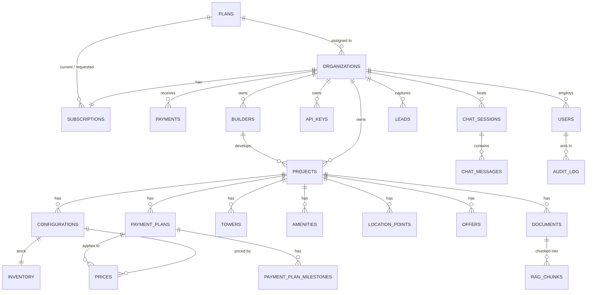

# Data Model

All models live in `backend/app/models.py` (SQLAlchemy 2). PostgreSQL 16 with the
`pgvector` and `pg_trgm` extensions. Tables are created by `init_db.py`, which
also performs lightweight `ADD COLUMN IF NOT EXISTS` migrations on boot.

## Tables at a glance (25)

| Group | Tables |
|---|---|
| **Tenancy & billing** | `plans`, `organizations`, `subscriptions`, `payments`, `users`, `api_keys` |
| **Catalog (facts)** | `projects`, `builders`, `configurations`, `prices`, `payment_plans`, `payment_plan_milestones`, `inventory`, `towers`, `amenities`, `location_points`, `offers` |
| **Knowledge (RAG)** | `documents`, `rag_chunks` |
| **Engagement** | `leads`, `chat_sessions`, `chat_messages`, `query_log` |
| **Platform** | `audit_log`, `settings` |

## Entity-relationship diagram

`ORGANIZATIONS` is the tenancy hub: nearly every business table hangs off it via
`organization_id`. `SETTINGS` and `QUERY_LOG` are omitted above (`SETTINGS` is a
platform-wide key/value store; `QUERY_LOG` references org + user for analytics).

## Tenancy & billing

- **plans** — a subscription tier. `max_employees`, `daily_llm_quota`,
  `price_monthly`, `is_active`. Seeded: **Basic** (5 emp / 25 q-day / ₹0),
  **Advanced** (25 / 100 / ₹2,999), **Enterprise** (1000 / 1000 / ₹9,999).
- **organizations** — a tenant (one real-estate company). Holds `plan_id`, widget
  greeting, assistant persona/name/avatar, CRM webhook config, and notification
  config. Everything tenant-owned references `organization_id`.
- **subscriptions** — *whether* an org has actually paid: `status`
  (trialing/active/past_due/suspended/cancelled), `current_period_end`,
  `trial_ends_at`, and a `requested_plan_id` for plan-change requests. The
  *effective* status is derived from the dates at read time (no cron).
- **payments** — the permanent record of money received (amount, method,
  reference, service period, a snapshot of the plan name). Powers receipts and
  history; a renewal never overwrites past rows.
- **users** — a person. `role` (`sales` | `manager` | `admin`), `tier`
  (`basic` | `advanced`), `is_super_admin`, `can_live_chat`, `organization_id`
  (null for the super-admin), `is_active`.
- **api_keys** — an integration credential. `channel` (`website` | `internal`)
  and `scope` (`widget` | `read_only` | `full`). Only a hash + prefix are stored.

## Catalog — where facts live (SQL-first)

- **projects** — name, `slug`, `city`, `locality`, `project_status`,
  `possession_date`, RERA, type, rise, launch price, `builder_id`,
  `organization_id`. `slug` is unique **per organization**.
- **builders** — developer/builder, org-scoped.
- **configurations** — a unit type (2BHK, Villa…) with areas; belongs to a project.
- **prices** — a price row under a configuration, optionally tied to a
  `payment_plan_id`; base price, unit (`per_sqft`/`total`), PLC, GST, effective
  dates. History is kept (old prices retained).
- **payment_plans** + **payment_plan_milestones** — named plans (e.g. `50:50`)
  and their staged percentages.
- **inventory** — total/available units per configuration.
- **towers**, **amenities**, **location_points**, **offers** — supporting facts,
  all under a project.

## Knowledge (RAG)

- **documents** — an uploaded file (brochure, cost sheet…), org- and
  project-scoped, with an indexing `status`.
- **rag_chunks** — chunked text + a pgvector `embedding` used for similarity
  search. Retrieval is always scoped to the org (and usually the project).

## Engagement

- **leads** — a captured lead (name, phone, email, message, `project_interest`,
  `source`, `page_url`, `status`), org-scoped. Created from the callback form or
  when a visitor types a phone number in chat.
- **chat_sessions** — a widget conversation (`session_id`, `mode` ai/human,
  `agent_id`, activity/seen timestamps), org-scoped. Retained ~15 days; the
  demand *intent* is kept for analytics after raw chats are purged.
- **chat_messages** — messages within a session (`role` user/agent/system, text).
- **query_log** — every query for analytics (source channel, org, latency, miss).

## Platform

- **audit_log** — who changed what (create/update/delete, entity, before/after).
- **settings** — key/value JSON store for platform-level config (active LLM
  provider + key, platform-owner notification config).

## Isolation invariants

- Every tenant-owned row carries `organization_id`.
- Reads are scoped on the server (`core/tenancy.py`); an object id alone never
  grants access across organizations.
- `projects.slug` is unique within an organization, so two companies may both
  have a "Green Valley".

See [security.md](security.md) for enforcement and
[architecture.md](architecture.md) for how the tables feed the pipeline.
