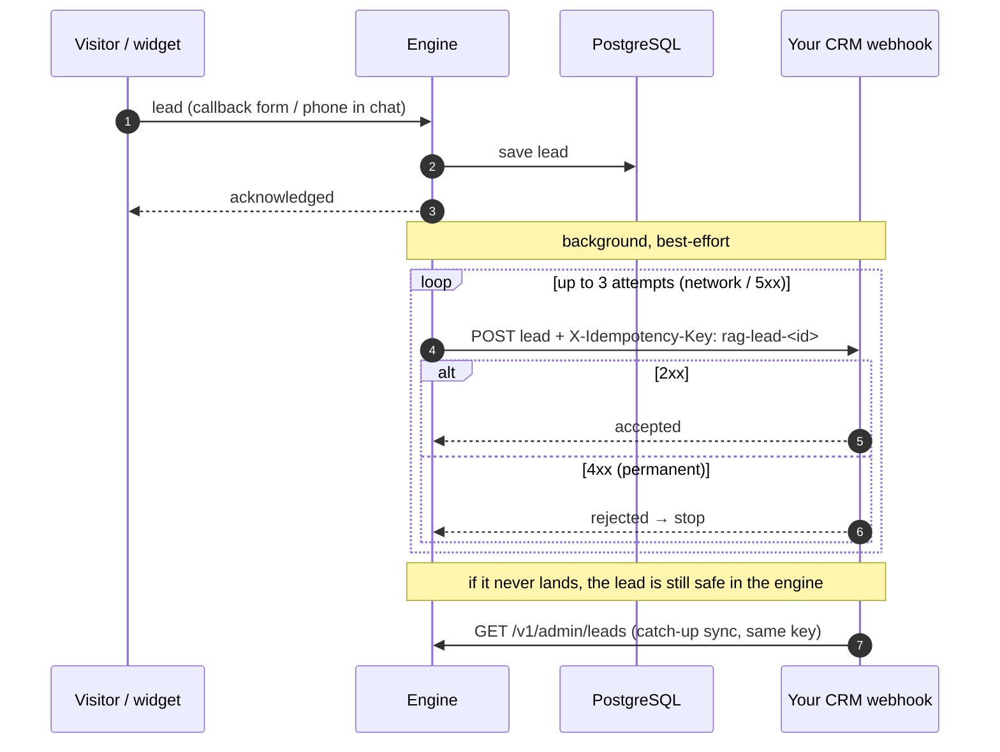

# Integrations Guide

How to connect PropX Estate to the outside world: the website chat widget, a CRM
(both directions), Telegram alerts, and WhatsApp. All of this is configured from
**Admin → 🔌 Integrations** and **Admin → 🤖 Assistant**.

First, understand two directions that are easy to confuse:

| | Direction | Who calls whom | Set up with |
|---|---|---|---|
| **🔌 API Keys** | **Inbound** | *They* call *us* (ask questions, read leads) | An API key sent as `X-API-Key`. |
| **📤 Lead Webhook** | **Outbound** | *We* call *them* (push every new lead) | A URL + optional shared secret. |

Most setups use both.

---

## 1. Website chat widget

Add the assistant to any site (WordPress, PHP, Shopify, plain HTML) with one
`<script>` tag.

### Steps
1. **Admin → Integrations → API Keys → Create key.** Choose **Used for: 🌐
   Website**, **Access: 🛡️ Widget only**. Copy the key (shown once).
2. Paste the generated snippet before `</body>` on your site:

```html
<script src="https://YOUR_DOMAIN/static/widget.js"
        data-api-url="https://YOUR_DOMAIN"
        data-api-key="px_YOUR_WIDGET_KEY"
        data-title="Ask about our projects"
        data-accent="#6b46ff"></script>
```

3. Customize the assistant's **name, photo, personality and greeting** in
   **Admin → Assistant → Identity & Persona** (no code change; the widget picks
   it up live).

### Notes
- The key is visible in the page source — that is fine. A **widget-scope** key
  can only run the four widget endpoints (`/v1/query`, `/v1/leads`,
  `/v1/widget/config`, `/v1/widget/poll`) and nothing else. **Never** embed a
  `full` key.
- `data-api-url` runs in the **visitor's browser**, so it uses your public
  domain (or `localhost` for local testing) — not `host.docker.internal`.

---

## 2. CRM — inbound (your CRM asks the engine)

Give your CRM a key so it can call `POST /v1/query`.

1. **Create key:** Used for **🏢 Internal tool**, Access **🔒 Read-only**.
2. Call the engine server-side:

```js
const res = await fetch("https://YOUR_DOMAIN/v1/query", {
  method: "POST",
  headers: { "X-API-Key": process.env.RAG_API_KEY, "Content-Type": "application/json" },
  body: JSON.stringify({ query, session_id: "crm-" + userId, format: "text" }),
});
const { answer_text } = await res.json();
```

- Keep the key in a **server-side** environment variable, never in frontend code.
- An **internal** channel key does not raise new-visitor alerts and does not
  appear in Live Chat (those are website-only).

---

## 3. CRM — outbound (the engine pushes leads to your CRM)

Every captured lead is POSTed to your CRM in real time.

1. **Admin → Integrations → 📤 Lead Webhook.**
2. Set **Your CRM's lead URL** (a URL that accepts a JSON `POST`).
3. Optional: set a **shared secret** — a header your CRM checks to confirm the
   call really came from us (default header name `X-Webhook-Secret`).

### Payload
Every lead arrives with the same fields:

```json
{
  "id": 37, "name": "…", "phone": "…", "email": "…", "message": "…",
  "project_interest": "GIC", "source": "widget", "page_url": "…",
  "status": "new", "created_at": "2026-07-17T…Z"
}
```

### Reliability
- Retried up to 3× on network errors / 5xx; a 4xx is treated as a permanent
  rejection (not retried).
- Every push carries `X-Idempotency-Key: rag-lead-<id>`, so a retry can never
  create a duplicate.
- If a push fails permanently, the lead is still safe in the engine — your CRM
  can **catch up** any time by pulling `GET /v1/admin/leads` (same API key).

### Lead → CRM push (sequence)



### Local testing caveat
For a CRM running in another local container, the engine (inside Docker) reaches
it at `http://host.docker.internal:<port>/…`, not `127.0.0.1`. In production, use
the CRM's real public URL.

---

## 4. Telegram alerts (new-visitor notifications)

Get pinged when a new visitor starts chatting, so someone can take over from
Live Chat. **Admin → Assistant → Notifications**.

### Steps
1. In Telegram, message **@BotFather** → `/newbot` → copy the **bot token**.
2. Add the bot to your team group (or start a private chat with it, and send it
   one message).
3. Get the **chat id** (e.g. via **@getidsbot**). Group ids look like
   `-1001234567890`.
4. In the app: **Notify via → Telegram**, paste the **bot token** and **chat id**,
   **Save**, then **Send test**.

Notes:
- The bot token is a secret — enter it in the app UI only.
- Telegram is the official Bot API (free, no ban risk), sent to
  `api.telegram.org`.

---

## 5. WhatsApp

WhatsApp is delivered through the generic **webhook** provider (**Notify via →
Webhook**), which POSTs to any URL with a body template and headers you define.
Two common ways:

### a) WhatsApp Cloud API (official, Meta)
1. Create a Meta app, add WhatsApp, get a **phone-number id** and a **permanent
   access token**.
2. In the app, **Notify via → Webhook**:
   - **URL:** `https://graph.facebook.com/v20.0/<PHONE_NUMBER_ID>/messages`
   - **Headers:** `Authorization: Bearer <ACCESS_TOKEN>`
   - **Body template** (Meta's shape; `{{text}}` is substituted):
     ```json
     {"messaging_product":"whatsapp","to":"<RECIPIENT>","type":"text","text":{"body":"{{text}}"}}
     ```
3. **Save**, then **Send test**.

### b) Unofficial WhatsApp HTTP service
Point the webhook URL at your service and match its body shape, e.g.:
```json
{"number":"9198XXXXXXXX","message":"{{text}}"}
```

> **Production caveat:** unofficial WhatsApp services can get your number banned
> by WhatsApp. Prefer the official Cloud API for anything customer-facing.

---

## Platform-owner alerts (super-admin)

Separate from tenant notifications: the platform owner configures their **own**
Telegram/webhook in **Platform → Alerts** to be pinged when a tenant requests a
plan change. This is delivered by the same `notify` service but stored per-platform.

---

## Where each setting lives

| Setting | Location |
|---|---|
| Widget script / API keys | Admin → Integrations → API Keys |
| Lead webhook (outbound) | Admin → Integrations → 📤 Lead Webhook |
| Assistant name / persona / greeting | Admin → Assistant → Identity & Persona |
| New-visitor notifications (tenant) | Admin → Assistant → Notifications |
| Platform-owner alerts | Platform → Alerts (super-admin) |
