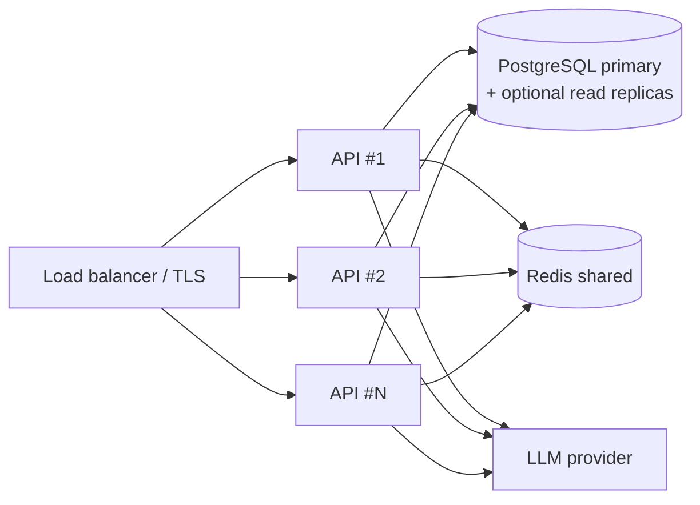

# Operations

Running PropX Estate in production: monitoring, backup, disaster recovery,
scaling and performance. Pairs with the [deployment checklist](deployment.md#production-checklist)
and [troubleshooting.md](troubleshooting.md).

## Monitoring

| Signal | Where | Watch for |
|---|---|---|
| Liveness | `GET /health` | Non-200 → API down. |
| Service health | `GET /v1/admin/system/…` (admin), or the **System Health** page | PostgreSQL, Redis, pgvector, LLM provider status. |
| Query latency & misses | `query_log` table / Analytics dashboard | Rising latency, growth in "unanswered" questions (data gaps). |
| Daily budgets | Redis `rl:day:*` keys / Analytics | Orgs hitting caps (upsell / abuse). |
| Errors | `docker compose logs api` | Tracebacks, `Redis unavailable`, webhook failures. |

Recommended external checks: an uptime monitor on `/health`, log shipping to your
platform, and an alert on API 5xx rate. LLM spend should be watched at the
provider (the per-org daily budget bounds it, but monitor the bill).

## Backup strategy

Two stateful volumes; Redis is **rebuildable** and needs no backup.

| Data | Volume | Backup |
|---|---|---|
| Database (facts, RAG vectors, users, billing, leads) | `db_data` | `pg_dump` on a schedule. **System of record.** |
| Uploaded files (brochures, avatars) | `uploads` | Filesystem/volume snapshot. |
| Sessions, quotas, rate limits | Redis (`redis_data`) | Not required — regenerated at runtime. |

```bash
# Logical backup of the database
docker compose exec -T db pg_dump -U "$POSTGRES_USER" "$POSTGRES_DB" | gzip > backup-$(date +%F).sql.gz

# Uploads
docker run --rm -v <project>_uploads:/u -v "$PWD":/out alpine \
  tar czf /out/uploads-$(date +%F).tgz -C /u .
```

Keep off-host copies. Test restores periodically — an untested backup is a guess.

## Disaster recovery

**Recovery objectives (guidance):** RPO = your backup interval (e.g. ≤24h with
nightly `pg_dump`, near-zero with WAL archiving/managed Postgres); RTO = minutes
to restore a dump onto a fresh stack.

Restore procedure:
1. Bring up a fresh stack (`docker compose up -d db redis`).
2. Restore the database dump into `db_data`.
3. Restore the `uploads` volume.
4. Start the API (`init_db`/`seed` are idempotent and safe to run over restored data).
5. Verify `/health`, System Health, and a sample query per tenant.

Redis is intentionally disposable: after DR, sessions/quotas simply start fresh.

## Scaling



- **API is stateless** (auth is JWT; session memory and limits live in Redis), so
  scale it **horizontally** behind a load balancer — no sticky sessions needed.
- **Redis must be shared** across API instances (single instance or a managed
  Redis) so limits/quotas/session memory are consistent.
- **PostgreSQL is the primary scaling axis.** Use connection pooling (e.g.
  PgBouncer), and read replicas for heavy read/analytics load. pgvector similarity
  queries benefit from an appropriate vector index as chunk volume grows.
- **Widget vs staff isolation** is built in: the public widget has its own daily
  budget, so a traffic spike there can't starve staff or the CRM.

## Performance considerations

- **SQL-first, LLM-last** keeps the expensive path rare: most price/inventory
  questions never call the LLM. Only "expensive" (LLM/RAG) queries count against
  quotas.
- **Answer cache:** repeated expensive answers are cached per org (invalidated on
  data changes), avoiding duplicate LLM calls.
- **Background tasks:** lead pushes and notifications run in the background so the
  user response is never delayed by a slow CRM/Telegram.
- **RAG tuning:** `RAG_TOP_K` and `RAG_SIMILARITY_THRESHOLD` trade recall vs cost;
  raise the threshold to send fewer, more relevant chunks to the LLM.
- **Model choice:** `gemini-flash-lite` (thinking off) is the default for speed
  and cost; the engine's grounded work rarely needs a heavier model.
- **Rate limits** protect both cost and availability (see [security.md](security.md)).

## Routine operations

- **Deploy/upgrade:** `docker compose build api && docker compose up -d` (reruns
  idempotent `init_db`/`seed`), then verify `/health` + System Health.
- **Schema change:** restart the API so migrations run.
- **Rotate secrets:** change `SECRET_KEY` (invalidates all JWTs → users re-login),
  DB and Redis passwords; roll API keys from the Admin console.
