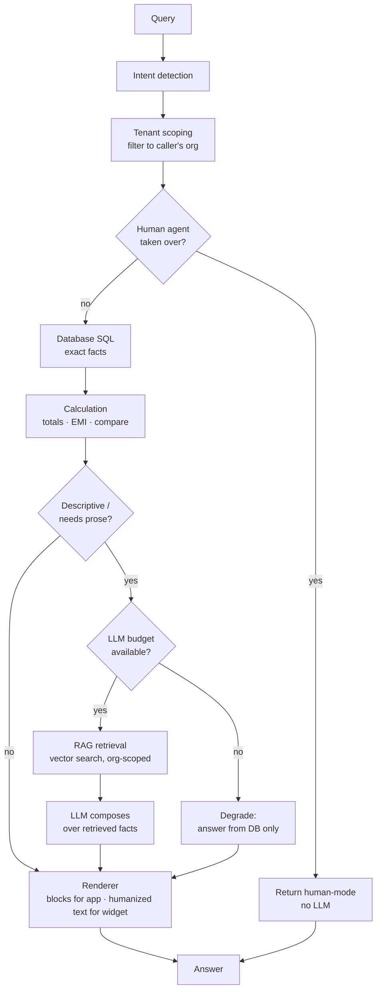

# The Answer Pipeline (RAG + the Golden Rule)

This is the heart of the engine. It is deliberately **not** "send the question to
an LLM." It is a hybrid pipeline where deterministic sources answer first and the
LLM is the last resort, reasoning only over facts already retrieved.

Implemented in `backend/app/services/orchestrator.py` (`handle_query`).

## The Golden Rule

> **Facts are deterministic. The LLM never invents them.**
>
> Prices, payment plans, inventory, areas, possession dates, RERA numbers and any
> figure come from SQL. The LLM only writes prose around facts that were already
> fetched. If nothing is found, the engine returns the "not available" message —
> it does not guess.

## Stages

1. **Intent detection** (`services/intent.py`, `nlparse.py`)
   - Classifies the question (price? payment plan? amenities? comparison? small talk?)
   - Resolves which project(s) it refers to, using fuzzy matching and per-session
     memory (so "and its possession?" follows the previous project).

2. **Tenant scoping** (`core/tenancy.py`)
   - Project ids are filtered to those owned by the caller's organization *before*
     any lookup — defence in depth against cross-tenant reads.

3. **Database (SQL)** (`services/database_service.py`)
   - Exact facts are read straight from the tables: `prices`, `payment_plans`,
     `configurations`, `inventory`, `offers`, `projects` (status/possession/RERA),
     `location_points`, `amenities`, `towers`.

4. **Calculation**
   - Derived numbers (totals, per-sq-ft ↔ total price, simple EMI, project
     comparisons) are computed in code, not by the LLM.

5. **RAG retrieval** (`services/rag/`)
   - For descriptive questions, the org's document chunks (`rag_chunks`) are
     searched by vector similarity (pgvector), scoped to the org / project.
   - Tuning: `RAG_TOP_K` (how many chunks) and `RAG_SIMILARITY_THRESHOLD`.

6. **LLM** (`services/llm/…`)
   - Only now, and only if needed, an LLM composes an answer **over the retrieved
     context**. A system prompt enforces the grounding rules; the org's persona
     controls tone only.
   - The LLM never receives secrets or another tenant's data.

7. **Renderer** (`services/renderer.py`)
   - The **app** receives structured `blocks` (tables, cards) so figures render
     precisely.
   - The **website widget / voice** receives humanized text (e.g. `₹8,900/sq ft`,
     "Possession: Dec 2027") produced deterministically from the same facts.

## Where documents come from

- An admin uploads a brochure/PDF (`/v1/admin/knowledge/documents`, `/extract`).
- Structured facts are extracted into the database (SQL-first).
- Remaining prose is chunked and embedded into `rag_chunks` for retrieval.
- Uploaded documents belong to one organization and are only ever retrieved for
  that org — there is no cross-tenant retrieval.

## Cost & safety controls

- **Cheap vs expensive:** plain SQL look-ups (price, inventory) are always free
  and never rate-limited. Only LLM/RAG queries count against quotas/budgets.
- **Per-employee quota** and **per-org daily budget** (`services/quota.py`,
  `ratelimit.py`) cap expensive queries; the public widget has its own separate
  budget so it can never starve staff or the CRM.
- **Degrade, don't fail:** when a budget is spent, the engine skips the LLM but
  still answers from the database.

## Prompt-injection posture

- Documents and personas are set only by an org admin, so a poisoned document or
  persona can only affect that same organization — never another tenant.
- Retrieval is org-scoped, so an uploaded file cannot pull another org's data.
- The grounding rules are applied on top of the org persona.
