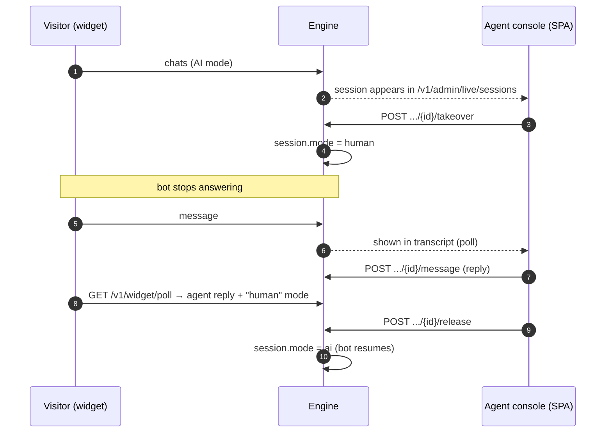
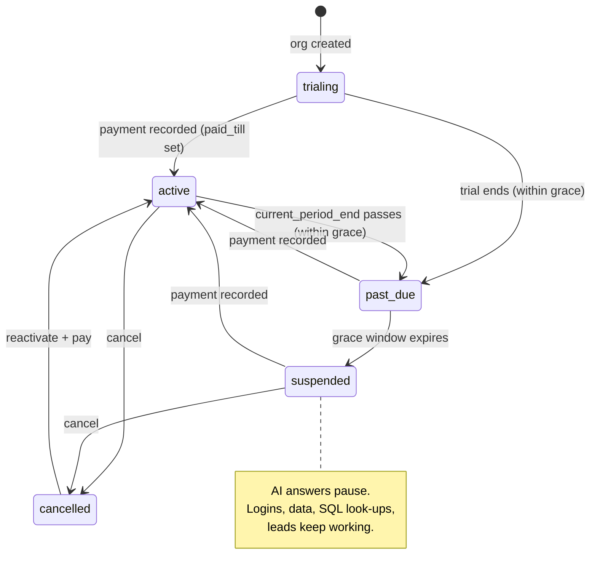
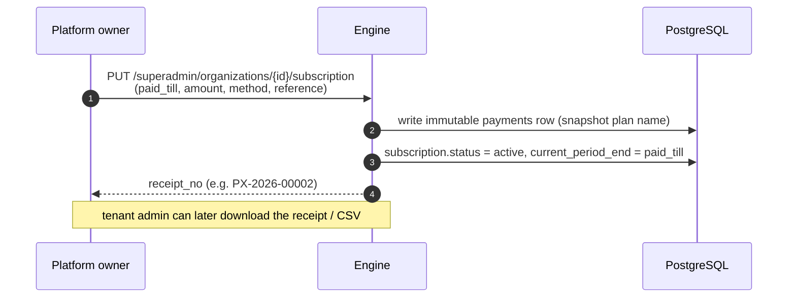
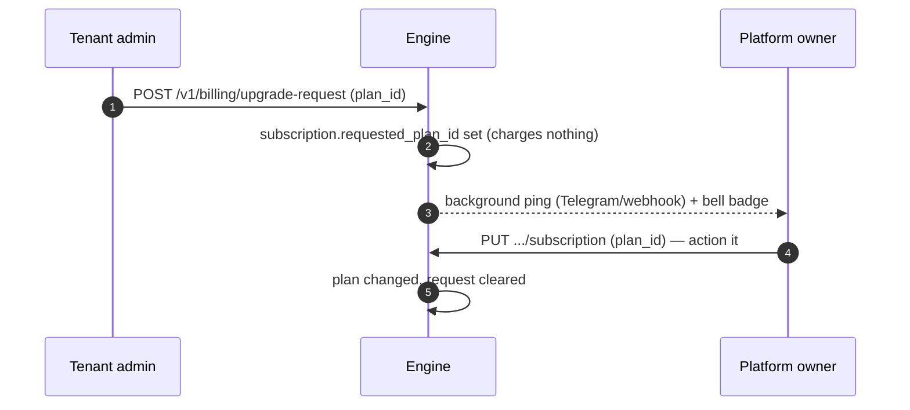
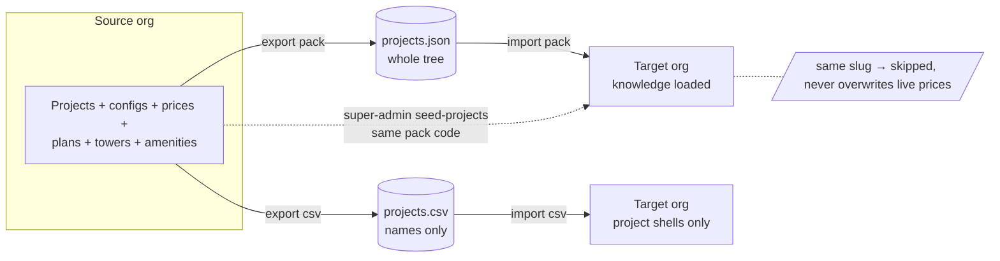

# Key Workflows

Sequence and state diagrams for the flows that span multiple components. For the
answer pipeline see [rag-pipeline.md](rag-pipeline.md); for auth flows see
[security.md](security.md); for the lead → CRM push see
[integrations.md](integrations.md).

## Human takeover (Live Chat)

## Subscription lifecycle (state machine)

Effective status is derived from dates at read time — no cron job. A lapse opens
a grace window before AI answers pause; data is never withheld.

## Record a payment (super-admin)

## Plan-change request (tenant → owner)

## Project import / export

Documents/brochures are never included — they stay with the org that owns them.
See [admin-guide.md](admin-guide.md#bulk-import--export-projects--data--import--export).
